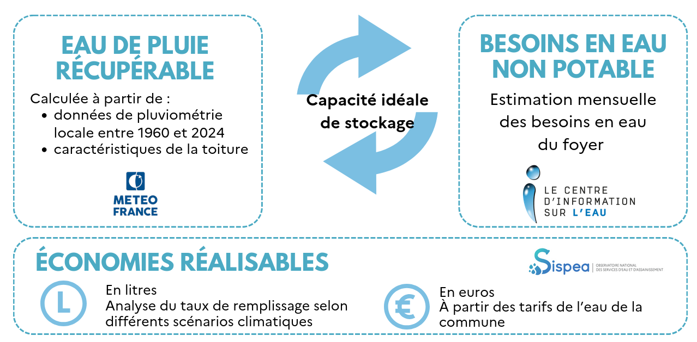

# Algorithme

L'algorithme mis en place utilise la [méthode du volume de référence (norme NF P16-005)](https://www.astee.org/publications/guide-sur-la-recuperation-et-utilisation-de-leau-de-pluie/).

Cette méthode détermine un volume de référence pour le stockage à installer. Ce volume est calculé en
prenant en compte les besoins et le régime pluviométrique local au cours de l’année à un pas de temps
mensuel. Elle utilise les données de pluviométrie mensuelle de 1960 à aujourd'hui.
